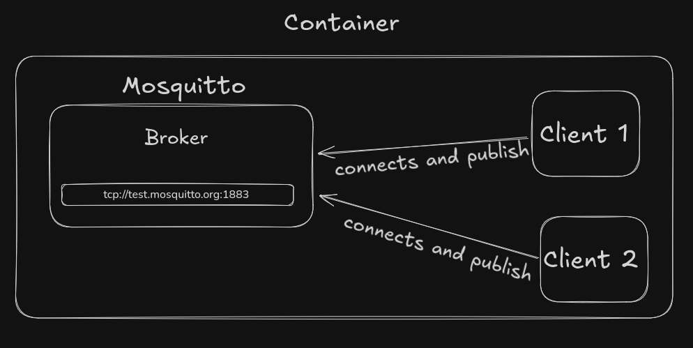

# Simple MQTT publish/subscribe project

The idea is to create a container that is running **mosquitto** and a **MQTT client**.

## Step by step explaining

This is the Dockerfile that is necessary to build the image.
### Building the Image
``` docker
FROM ubuntu:latest

RUN apt update && \
    apt install -y default-jdk mosquitto

COPY ./littleClient/ /
COPY ./mqttsetup.sh /

RUN chmod +x ./mqttsetup.sh

CMD ["./mqttsetup.sh"]
```
By running:
```bash
sudo docker build -t mqttexample -f Dockerfile .
```
We begin the building process.
> [!WARNING]
> docker needs admin Permissions

1) `FROM ubuntu:latest` 
Downloads the latest ubuntu image. The OS is necessary to run the environment
2) This shell commands:
``` docker
RUN apt update && \
    apt install -y default-jdk mosquitto
```
Downloads all the necessary to run the scripts and the broker:
- **mosquitto**: the broker
- **javasdk**: all the necessary java tools to run the java code, probably more than necessary

3) COPY commands:
``` docker
COPY ./littleClient/ /
COPY ./mqttsetup.sh /
```
From the directory we are in it copies the java mqttexample and the shell script that will execute everything on running

4) Permission: 
```docker
RUN chmod +x ./mqttsetup.sh
```
It is a script, so it is necessary to make it executable to run it
5) Command on startup
```docker
CMD ["./mqttsetup.sh"]
```
This is the command that will be executed when the container will start running
The script contains the mosquitto startup and the java code execution

After the build phase is over and the image is produced we can run it.
```bash
sudo docker run mqttexample
```
This will run the docker image in a container

## Graphics view of the container

